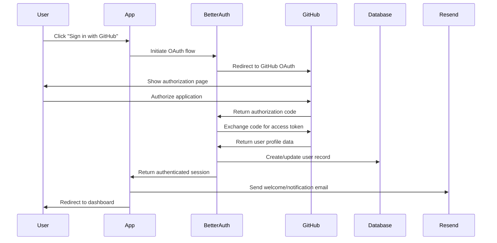
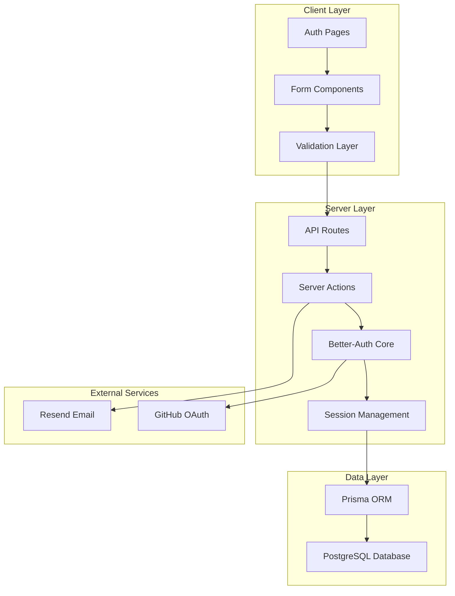

# Authentication System Design Document

## Overview

This design implements a modern, secure authentication system using better-auth as the core authentication library, integrated with GitHub OAuth for social login, Resend for email notifications, and a comprehensive validation stack. The system provides beautiful UI components, proper error handling, and type-safe data flow throughout the application.

### Key Technologies
- **better-auth**: Modern authentication library with built-in OAuth support
- **GitHub OAuth**: Social authentication provider
- **Resend**: Email service for transactional emails
- **zod**: Schema validation library
- **react-hook-form**: Form state management and validation
- **next-safe-action**: Type-safe server actions
- **next-zod-route**: Type-safe API routes
- **Prisma**: Database ORM (already configured)
- **Radix UI**: Accessible UI components (already available)

## Architecture

### Authentication Flow


### System Architecture


## Components and Interfaces

### Database Schema Extensions

The existing Prisma schema will be extended with user authentication tables:

```prisma
model User {
  id            String    @id @default(cuid())
  email         String    @unique
  name          String?
  image         String?
  githubId      String?   @unique
  githubUsername String?
  emailVerified DateTime?
  createdAt     DateTime  @default(now())
  updatedAt     DateTime  @updatedAt
  
  accounts      Account[]
  sessions      Session[]
  
  @@map("users")
}

model Account {
  id                String  @id @default(cuid())
  userId            String
  type              String
  provider          String
  providerAccountId String
  refresh_token     String?
  access_token      String?
  expires_at        Int?
  token_type        String?
  scope             String?
  id_token          String?
  session_state     String?
  
  user User @relation(fields: [userId], references: [id], onDelete: Cascade)
  
  @@unique([provider, providerAccountId])
  @@map("accounts")
}

model Session {
  id           String   @id @default(cuid())
  sessionToken String   @unique
  userId       String
  expires      DateTime
  
  user User @relation(fields: [userId], references: [id], onDelete: Cascade)
  
  @@map("sessions")
}
```

### Core Authentication Configuration

**better-auth Configuration** (`src/lib/auth.ts`):
```typescript
import { betterAuth } from "better-auth"
import { prismaAdapter } from "better-auth/adapters/prisma"
import { github } from "better-auth/providers/github"

export const auth = betterAuth({
  database: prismaAdapter(prisma, {
    provider: "postgresql"
  }),
  providers: [
    github({
      clientId: process.env.GITHUB_CLIENT_ID!,
      clientSecret: process.env.GITHUB_CLIENT_SECRET!,
    })
  ],
  emailAndPassword: {
    enabled: false // Only OAuth for now
  },
  session: {
    expiresIn: 60 * 60 * 24 * 7, // 7 days
    updateAge: 60 * 60 * 24, // 24 hours
  },
  callbacks: {
    async signIn({ user, account }) {
      // Send welcome email for new users
      if (account?.provider === "github") {
        await sendWelcomeEmail(user.email, user.name)
      }
      return true
    }
  }
})
```

### Validation Schemas

**Authentication Schemas** (`src/lib/validations/auth.ts`):
```typescript
import { z } from "zod"

export const signInSchema = z.object({
  email: z.string().email("Invalid email address"),
  password: z.string().min(8, "Password must be at least 8 characters"),
})

export const userProfileSchema = z.object({
  name: z.string().min(1, "Name is required").max(100),
  email: z.string().email("Invalid email address"),
})

export const sessionSchema = z.object({
  user: z.object({
    id: z.string(),
    email: z.string().email(),
    name: z.string().nullable(),
    image: z.string().url().nullable(),
  }),
  expires: z.string().datetime(),
})
```

### UI Components Architecture

**Authentication Pages Structure**:
- `/auth/signin` - Main sign-in page with GitHub OAuth
- `/auth/error` - Authentication error handling
- `/auth/callback` - OAuth callback handling
- `/unauthorized` - Access denied page
- `/404` - Custom not found page

**Component Hierarchy**:
```
AuthLayout
├── SignInForm
│   ├── GitHubSignInButton
│   ├── LoadingSpinner
│   └── ErrorMessage
├── AuthCard
└── AuthBackground
```

### Form Validation Integration

**React Hook Form with Zod** (`src/components/auth/signin-form.tsx`):
```typescript
import { useForm } from "react-hook-form"
import { zodResolver } from "@hookform/resolvers/zod"
import { signInSchema } from "@/lib/validations/auth"

const form = useForm({
  resolver: zodResolver(signInSchema),
  defaultValues: {
    email: "",
    password: "",
  },
})
```

### Server Actions and API Routes

**Type-Safe Server Actions** (`src/lib/actions/auth.ts`):
```typescript
import { createSafeAction } from "next-safe-action"
import { signInSchema } from "@/lib/validations/auth"

export const signInAction = createSafeAction(signInSchema, async (data) => {
  // Implementation with better-auth
})
```

**Type-Safe API Routes** (`app/api/auth/[...better-auth]/route.ts`):
```typescript
import { auth } from "@/lib/auth"
import { toNextJsHandler } from "better-auth/next-js"

const { GET, POST } = toNextJsHandler(auth)

export { GET, POST }
```

## Data Models

### User Data Flow
1. **GitHub Profile Data**: Retrieved during OAuth flow
2. **Local User Record**: Stored in PostgreSQL via Prisma
3. **Session Data**: Managed by better-auth with secure cookies
4. **Email Notifications**: Triggered via Resend integration

### Session Management
- **Storage**: Secure HTTP-only cookies
- **Expiration**: 7 days with 24-hour refresh window
- **Security**: CSRF protection, secure flags, SameSite attributes

## Error Handling

### Error Page Hierarchy
1. **Authentication Errors**: Specific error codes with user-friendly messages
2. **Authorization Errors**: Clear unauthorized access messaging
3. **Network Errors**: Retry mechanisms and offline handling
4. **Validation Errors**: Field-level error display with react-hook-form

### Error Boundaries
- **Global Error Boundary**: Catches unexpected errors
- **Auth Error Boundary**: Handles authentication-specific errors
- **Form Error Boundary**: Manages form validation and submission errors

### Error Types and Handling
```typescript
enum AuthErrorType {
  OAUTH_ERROR = "oauth_error",
  SESSION_EXPIRED = "session_expired",
  UNAUTHORIZED = "unauthorized",
  EMAIL_SEND_FAILED = "email_send_failed",
  DATABASE_ERROR = "database_error"
}
```

## Testing Strategy

### Unit Tests
- **Authentication utilities**: Session validation, token handling
- **Validation schemas**: Zod schema testing
- **Form components**: React Hook Form integration
- **Server actions**: next-safe-action validation

### Integration Tests
- **OAuth flow**: End-to-end GitHub authentication
- **Email sending**: Resend integration testing
- **Database operations**: User creation and updates
- **Session management**: Login/logout flows

### E2E Tests
- **Complete authentication flow**: Sign in → Dashboard → Sign out
- **Error scenarios**: Invalid credentials, network failures
- **Responsive design**: Mobile and desktop authentication
- **Accessibility**: Screen reader and keyboard navigation

### Test Structure
```
src/test/
├── auth/
│   ├── auth-config.test.ts
│   ├── signin-form.test.tsx
│   └── oauth-flow.test.ts
├── components/
│   ├── auth-pages.test.tsx
│   └── error-pages.test.tsx
└── e2e/
    ├── authentication.spec.ts
    └── error-handling.spec.ts
```

## Security Considerations

### OAuth Security
- **State parameter**: CSRF protection for OAuth flows
- **Secure redirects**: Whitelist allowed redirect URLs
- **Token storage**: Secure handling of access/refresh tokens

### Session Security
- **HTTP-only cookies**: Prevent XSS attacks
- **Secure flags**: HTTPS-only transmission
- **SameSite attributes**: CSRF protection
- **Session rotation**: Regular token refresh

### Data Protection
- **Minimal data storage**: Only necessary user information
- **Encryption**: Sensitive data encryption at rest
- **Access logging**: Authentication event logging
- **Rate limiting**: Prevent brute force attacks

## Email Integration

### Resend Configuration
- **Transactional emails**: Welcome, security notifications
- **Template system**: Reusable email templates
- **Error handling**: Graceful degradation if email fails
- **Tracking**: Email delivery and open tracking

### Email Types
1. **Welcome Email**: New user registration
2. **Security Alert**: New device/location login
3. **Password Reset**: Future password reset functionality
4. **Account Updates**: Profile changes notification

## Performance Considerations

### Optimization Strategies
- **Session caching**: Redis for session storage (optional)
- **Database indexing**: Optimized queries for user lookups
- **Image optimization**: User avatar caching and resizing
- **Bundle splitting**: Lazy loading of authentication components

### Monitoring
- **Authentication metrics**: Success/failure rates
- **Performance tracking**: Page load times
- **Error monitoring**: Authentication error rates
- **User analytics**: Sign-in patterns and retention