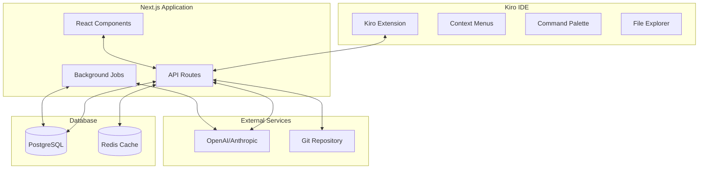

# Design Document

## Overview

Synthora is a comprehensive Git analysis extension for Kiro that combines a Next.js web application with a Kiro extension to provide AI-powered insights into code evolution. The system analyzes Git repository history to generate interactive timelines, AI-driven file stories, risk assessments, and team collaboration insights.

The architecture consists of three main components:
1. **Next.js Web Application** - Provides the main UI, API routes, and data processing
2. **Kiro Extension** - Integrates with the IDE for seamless workflow integration
3. **PostgreSQL Database** - Stores analysis results, cached data, and AI-generated content

## Architecture

### System Architecture Diagram



### Technology Stack

#### Frontend (Next.js + Kiro Extension)
- **Next.js 14** with App Router
- **React 18** with TypeScript
- **Tailwind CSS** for styling
- **shadcn/ui** components
- **Recharts** for data visualizations
- **TanStack Query** for state management
- **Lucide React** for icons

#### Backend (Next.js API Routes)
- **Next.js API Routes** (serverless functions)
- **Prisma ORM** with PostgreSQL
- **simple-git** for Git operations
- **OpenAI SDK** for AI story generation
- **Bull Queue** with Redis for background jobs

#### Database & Caching
- **PostgreSQL** for persistent data
- **Redis** for caching and job queues
- **pgvector** extension for semantic search (optional)

## Components and Interfaces

### Core Services

#### GitAnalyzer Service
```typescript
interface GitAnalyzer {
  analyzeRepository(repoPath: string): Promise<AnalysisResult>
  getCommitHistory(repoPath: string, options?: GitOptions): Promise<Commit[]>
  getFileHistory(repoPath: string, filePath: string): Promise<FileChange[]>
  calculateFileMetrics(commits: Commit[]): Promise<FileMetrics[]>
  detectPatterns(commits: Commit[]): Promise<Pattern[]>
}
```

#### StoryGenerator Service
```typescript
interface StoryGenerator {
  generateFileStory(fileHistory: FileChange[], metrics: FileMetrics): Promise<string>
  generateTeamInsights(collaborationData: CollaborationData): Promise<TeamInsights>
  callAI(prompt: string, context: any): Promise<string>
}
```

#### RiskAnalyzer Service
```typescript
interface RiskAnalyzer {
  calculateRiskScores(metrics: FileMetrics[]): Promise<RiskScore[]>
  identifyHotspots(fileMetrics: FileMetrics[]): Promise<Hotspot[]>
  predictRiskTrends(historicalData: HistoricalMetrics[]): Promise<RiskTrend[]>
}
```

### API Routes Structure

```
/api/
├── repositories/
│   ├── route.ts                    # GET, POST repositories
│   └── [id]/
│       ├── analyze/route.ts        # POST start analysis
│       ├── timeline/route.ts       # GET timeline data
│       ├── hotspots/route.ts       # GET risk analysis
│       ├── files/
│       │   └── [path]/
│       │       ├── story/route.ts  # GET file story
│       │       └── metrics/route.ts # GET file metrics
│       └── search/
│           └── semantic/route.ts   # POST semantic search
├── analysis/
│   ├── status/[jobId]/route.ts     # GET job status
│   └── results/[id]/route.ts       # GET analysis results
└── health/route.ts                 # GET system health
```

### React Components Architecture

```
src/
├── app/
│   ├── dashboard/
│   │   ├── page.tsx                # Main dashboard
│   │   ├── timeline/page.tsx       # Timeline view
│   │   ├── hotspots/page.tsx       # Risk analysis view
│   │   └── search/page.tsx         # Semantic search
│   └── api/                        # API routes
├── components/
│   ├── timeline/
│   │   ├── TimelineChart.tsx       # Main timeline visualization
│   │   ├── TimelineFilters.tsx     # Filter controls
│   │   ├── CommitTooltip.tsx       # Commit details popup
│   │   └── TimelineControls.tsx    # Zoom and navigation
│   ├── analysis/
│   │   ├── FileStoryPanel.tsx      # AI-generated file stories
│   │   ├── RiskHeatmap.tsx         # File risk visualization
│   │   ├── MetricsTable.tsx        # Detailed metrics display
│   │   └── TeamInsights.tsx        # Collaboration patterns
│   ├── search/
│   │   ├── SemanticSearch.tsx      # Search interface
│   │   ├── SearchResults.tsx       # Results display
│   │   └── SearchFilters.tsx       # Search refinement
│   └── ui/                         # shadcn/ui components
├── lib/
│   ├── services/
│   │   ├── git-analyzer.ts         # Git operations
│   │   ├── story-generator.ts      # AI story generation
│   │   ├── risk-analyzer.ts        # Risk calculations
│   │   └── semantic-search.ts      # Search functionality
│   ├── utils/
│   │   ├── date-utils.ts           # Date formatting
│   │   ├── chart-utils.ts          # Chart data processing
│   │   └── git-utils.ts            # Git helper functions
│   └── prisma.ts                   # Database client
└── types/
    ├── git.ts                      # Git-related types
    ├── analysis.ts                 # Analysis result types
    └── api.ts                      # API response types
```

### Kiro Extension Structure

```
extension/
├── src/
│   ├── extension.ts                # Main extension entry
│   ├── commands/
│   │   ├── analyze-file.ts         # File story command
│   │   ├── show-timeline.ts        # Timeline command
│   │   └── show-hotspots.ts        # Hotspots command
│   ├── panels/
│   │   ├── TimelinePanel.ts        # Timeline webview
│   │   ├── StoryPanel.ts           # File story webview
│   │   └── HotspotsPanel.ts        # Risk analysis webview
│   ├── services/
│   │   ├── api-client.ts           # Next.js API communication
│   │   └── workspace-manager.ts    # Workspace operations
│   └── types/
│       └── kiro.d.ts               # Kiro API types
├── package.json                    # Extension manifest
└── vite.config.ts                  # Build configuration
```

## Data Models

### Database Schema (Prisma)

```prisma
model Repository {
  id            Int       @id @default(autoincrement())
  name          String
  path          String    @unique
  lastAnalyzed  DateTime?
  createdAt     DateTime  @default(now())
  updatedAt     DateTime  @updatedAt
  
  commits       Commit[]
  fileMetrics   FileMetrics[]
  fileStories   FileStory[]
  embeddings    Embedding[]
  
  @@map("repositories")
}

model Commit {
  id           Int       @id @default(autoincrement())
  repositoryId Int
  sha          String    @unique
  authorName   String
  authorEmail  String
  message      String
  timestamp    DateTime
  filesChanged Int       @default(0)
  insertions   Int       @default(0)
  deletions    Int       @default(0)
  createdAt    DateTime  @default(now())
  
  repository   Repository @relation(fields: [repositoryId], references: [id])
  fileChanges  FileChange[]
  
  @@map("commits")
}

model FileChange {
  id         Int    @id @default(autoincrement())
  commitId   Int
  filePath   String
  changeType String // 'added', 'modified', 'deleted'
  insertions Int    @default(0)
  deletions  Int    @default(0)
  createdAt  DateTime @default(now())
  
  commit     Commit @relation(fields: [commitId], references: [id])
  
  @@map("file_changes")
}

model FileMetrics {
  id           Int      @id @default(autoincrement())
  repositoryId Int
  filePath     String
  commitCount  Int      @default(0)
  authorCount  Int      @default(0)
  riskScore    Float    @default(0)
  totalChanges Int      @default(0)
  bugCommits   Int      @default(0)
  lastModified DateTime
  createdAt    DateTime @default(now())
  updatedAt    DateTime @updatedAt
  
  repository   Repository @relation(fields: [repositoryId], references: [id])
  
  @@unique([repositoryId, filePath])
  @@map("file_metrics")
}

model FileStory {
  id           Int      @id @default(autoincrement())
  repositoryId Int
  filePath     String
  storyContent String
  generatedAt  DateTime @default(now())
  
  repository   Repository @relation(fields: [repositoryId], references: [id])
  
  @@unique([repositoryId, filePath])
  @@map("file_stories")
}

model Embedding {
  id           Int      @id @default(autoincrement())
  repositoryId Int
  contentType  String   // 'commit', 'comment', 'pr'
  contentId    String
  contentText  String
  embedding    Float[]  // Vector embedding
  createdAt    DateTime @default(now())
  
  repository   Repository @relation(fields: [repositoryId], references: [id])
  
  @@map("embeddings")
}
```

### Core TypeScript Interfaces

```typescript
interface AnalysisResult {
  repositoryId: number
  commits: Commit[]
  fileMetrics: FileMetrics[]
  patterns: Pattern[]
  teamInsights: TeamInsights
  processingTime: number
}

interface Commit {
  sha: string
  author: string
  email: string
  message: string
  timestamp: Date
  filesChanged: number
  insertions: number
  deletions: number
  files: FileChange[]
}

interface FileMetrics {
  filePath: string
  commitCount: number
  authorCount: number
  riskScore: number
  totalChanges: number
  bugCommits: number
  lastModified: Date
  authors: string[]
}

interface RiskScore {
  filePath: string
  score: number
  factors: {
    changeFrequency: number
    authorDiversity: number
    changeVolume: number
    bugRatio: number
  }
  recommendations: string[]
}

interface TeamInsights {
  collaborationPatterns: CollaborationPattern[]
  knowledgeSilos: KnowledgeSilo[]
  contributionMetrics: ContributionMetrics
  reviewPatterns: ReviewPattern[]
}
```

## Error Handling

### Error Categories and Strategies

#### Git Operation Errors
- **Repository not found**: Provide clear guidance on repository setup
- **Permission denied**: Guide user through access configuration
- **Corrupted repository**: Offer repository repair suggestions
- **Large repository timeout**: Implement progressive analysis with user feedback

#### AI Service Errors
- **API rate limits**: Implement exponential backoff and queue management
- **Service unavailable**: Provide cached results and retry mechanisms
- **Invalid responses**: Fallback to template-based story generation
- **Cost limits exceeded**: Notify user and offer reduced functionality

#### Database Errors
- **Connection failures**: Implement connection pooling and retry logic
- **Data corruption**: Provide data validation and recovery procedures
- **Storage limits**: Implement cleanup policies and user notifications
- **Migration failures**: Provide rollback mechanisms and manual recovery

#### Extension Integration Errors
- **Kiro API changes**: Implement version compatibility checks
- **Communication failures**: Provide offline mode and sync capabilities
- **UI rendering issues**: Implement graceful degradation and error boundaries

### Error Recovery Mechanisms

```typescript
interface ErrorHandler {
  handleGitError(error: GitError): Promise<ErrorRecovery>
  handleAIError(error: AIError): Promise<ErrorRecovery>
  handleDatabaseError(error: DatabaseError): Promise<ErrorRecovery>
  handleNetworkError(error: NetworkError): Promise<ErrorRecovery>
}

interface ErrorRecovery {
  canRecover: boolean
  recoveryAction?: () => Promise<void>
  fallbackData?: any
  userMessage: string
  technicalDetails?: string
}
```

## Testing Strategy

### Unit Testing
- **Services**: Test Git analysis, AI integration, and risk calculation logic
- **Components**: Test React components with various data states
- **API Routes**: Test all endpoints with different scenarios
- **Utilities**: Test helper functions and data transformations

### Integration Testing
- **Database Operations**: Test Prisma queries and migrations
- **Git Operations**: Test with various repository structures
- **AI Integration**: Test with mock AI responses and error conditions
- **Extension Communication**: Test Kiro extension API integration

### End-to-End Testing
- **User Workflows**: Test complete user journeys from repository analysis to insights
- **Performance**: Test with large repositories and concurrent users
- **Error Scenarios**: Test error handling and recovery mechanisms
- **Cross-platform**: Test on different operating systems and Git configurations

### Testing Tools
- **Vitest** for unit and integration tests
- **React Testing Library** for component tests
- **Playwright** for end-to-end tests
- **MSW** for API mocking
- **Test containers** for database testing

## Performance Considerations

### Optimization Strategies

#### Git Analysis Performance
- **Incremental Analysis**: Only analyze new commits since last run
- **Parallel Processing**: Use worker threads for large repository analysis
- **Selective Analysis**: Allow users to analyze specific date ranges or file patterns
- **Caching**: Cache expensive Git operations and file metrics

#### Database Performance
- **Indexing**: Create indexes on frequently queried columns
- **Connection Pooling**: Use connection pooling for concurrent requests
- **Query Optimization**: Use Prisma query optimization techniques
- **Data Archiving**: Archive old analysis data to maintain performance

#### UI Performance
- **Virtual Scrolling**: For large timeline and file lists
- **Lazy Loading**: Load components and data on demand
- **Memoization**: Cache expensive calculations and renders
- **Progressive Loading**: Show partial results while analysis continues

#### Memory Management
- **Streaming**: Process large Git logs in streams
- **Garbage Collection**: Properly dispose of large objects
- **Memory Monitoring**: Track memory usage and implement limits
- **Background Processing**: Move heavy operations to background jobs

### Performance Targets
- **Timeline Load**: < 2 seconds for 1000 commits
- **File Story Generation**: < 10 seconds per file
- **Repository Analysis**: < 30 seconds for medium repositories (< 10k commits)
- **UI Responsiveness**: < 100ms for user interactions
- **Memory Usage**: < 500MB for typical analysis sessions